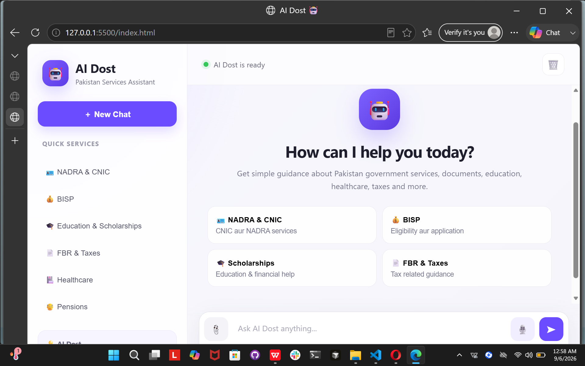

<div align="center">


<br>

[](https://www.python.org/)
[](https://fastapi.tiangolo.com/)
[](https://www.alibabacloud.com/help/en/model-studio/)
[](https://developer.mozilla.org/en-US/docs/Web/JavaScript)
[](https://github.com/AyeshaZahra-zz/AI-Dost-)

<br>

**An AI-powered Pakistan Services Assistant for conversational help, multilingual interaction, document explanation, and voice responses.**

</div>

---

## 🌟 Overview

**AI Dost** is an AI-powered conversational assistant designed to provide simple and accessible guidance around **Pakistan government and public services**.

The application combines a modern web interface with a **FastAPI backend** and **Qwen AI**. It supports conversational questions, multilingual responses, document explanation, and text-to-speech functionality.

The assistant is designed around everyday services and topics such as **NADRA, CNIC, BISP, education, scholarships, FBR, taxes, healthcare, and pensions**.

> **Important:** AI Dost provides guidance and should not be treated as an official government authority. Users should verify time-sensitive information with the relevant official department.

---

## 📸 Project Preview

### AI Dost Home Interface

<p align="center">
  
</p>

The interface provides quick access to common service categories, a new-chat option, a conversational input area, and voice interaction controls.

---

## ✨ Key Features

| Feature | Description |
|---|---|
| 🤖 **AI Chatbot** | Ask questions and receive AI-generated conversational responses. |
| 🇵🇰 **Pakistan Services** | Focused guidance for public-service topics such as NADRA, BISP, FBR, education, healthcare, and pensions. |
| 🌐 **Multilingual Support** | Responds according to the language and writing style used by the user. |
| 📝 **Conversation Context** | Uses recent conversation history when processing questions. |
| 📄 **Document Explanation** | Upload a supported document and ask AI to explain its content. |
| 🔊 **Text-to-Speech** | Converts generated responses into audio through the TTS endpoint. |
| 🎤 **Voice Interaction** | Frontend includes voice interaction controls for a more accessible experience. |
| ⚡ **FastAPI Backend** | Provides a lightweight REST API between the interface and AI services. |
| 🔐 **Environment Variables** | API credentials are loaded through environment variables rather than hard-coded secrets. |
| ❤️ **User-Friendly UI** | Clean interface with quick-service categories and simple conversational interaction. |

---

## 🔄 Project Workflow

### 💬 Chat Workflow

```text
┌──────────────────────┐
│       User           │
│  Ask a Question      │
└──────────┬───────────┘
           │
           ▼
┌──────────────────────┐
│   AI Dost Frontend   │
│    HTML / CSS / JS   │
└──────────┬───────────┘
           │ HTTP Request
           ▼
┌──────────────────────┐
│    FastAPI Backend   │
│       /ask           │
└──────────┬───────────┘
           │
           ▼
┌──────────────────────┐
│      Qwen AI         │
│  Response Generation │
└──────────┬───────────┘
           │
           ▼
┌──────────────────────┐
│    AI Response       │
│     + Language       │
└──────────┬───────────┘
           │
           ▼
┌──────────────────────┐
│      User UI         │
└──────────────────────┘
```

### 📄 Document Workflow

```text
Document Upload
      │
      ▼
Temporary File
      │
      ▼
Text Extraction
      │
      ▼
Document Processing
      │
      ▼
AI Explanation
      │
      ▼
Response Returned
      │
      ▼
Temporary File Deleted
```

### 🔊 Voice / TTS Workflow

```text
AI Response
     │
     ▼
   /tts
     │
     ▼
Qwen / DashScope Speech Synthesis
     │
     ▼
Base64 Encoded Audio
     │
     ▼
Frontend Audio Playback
```

---

## 🏗️ System Architecture

```text
                    ┌─────────────────────┐
                    │       User          │
                    └──────────┬──────────┘
                               │
                               ▼
                    ┌─────────────────────┐
                    │     index.html      │
                    │   HTML / CSS / JS   │
                    └──────────┬──────────┘
                               │
                         HTTP / JSON
                               │
                               ▼
                    ┌─────────────────────┐
                    │      FastAPI        │
                    │       main.py       │
                    └──────┬─────┬───────┘
                           │     │
              ┌────────────┘     └──────────────┐
              ▼                                 ▼
     ┌─────────────────┐               ┌─────────────────┐
     │   llm_service   │               │document_handler │
     │      Qwen AI    │               │ Text Extraction │
     └────────┬────────┘               └────────┬────────┘
              │                                 │
              └──────────────┬──────────────────┘
                             ▼
                    ┌─────────────────┐
                    │  AI Generated   │
                    │     Result      │
                    └────────┬────────┘
                             ▼
                    ┌─────────────────┐
                    │      User       │
                    └─────────────────┘
```

---

## 🔌 API Endpoints

The FastAPI backend currently exposes the following application endpoints:

| Method | Endpoint | Purpose | Input |
|:---:|---|---|---|
| `POST` | `/ask` | Sends a question to AI Dost and returns an AI response. | JSON |
| `POST` | `/explain-document` | Uploads a document and generates an explanation. | Multipart file + question |
| `POST` | `/tts` | Converts text into speech audio. | JSON |
| `GET` | `/health` | Checks backend and AI service status. | None |
| `GET` | `/docs` | Opens the interactive FastAPI Swagger documentation. | None |

### `/ask` Request Example

```json
{
  "text": "How can I apply for a CNIC?",
  "language": "auto",
  "history": []
}
```

Example response:

```json
{
  "response": "AI generated response...",
  "language": "auto"
}
```

### `/tts` Request Example

```json
{
  "text": "Welcome to AI Dost."
}
```

### `/health` Response

```json
{
  "status": "ok",
  "ai": "Alibaba Qwen",
  "services": 12
}
```

---

## 🧠 Language Handling

AI Dost is designed to follow the user's current communication style.

```text
English
   ↓
English Response

Roman Urdu
   ↓
Roman Urdu Response

Urdu Script
   ↓
Urdu Script Response

Mixed English + Urdu
   ↓
Naturally Mixed Response
```

The backend also uses recent conversation messages to provide context when processing a new question.

---

## 📄 Document Question Answering

The document endpoint follows a temporary-file workflow:

```text
User Uploads File
       ↓
FastAPI Receives File
       ↓
Temporary File Created
       ↓
Text Extracted
       ↓
Document Sent for Explanation
       ↓
AI Response Returned
       ↓
Temporary File Deleted
```

This allows users to ask questions about uploaded content without permanently storing the uploaded file through this endpoint.

---

## 🛠️ Technology Stack

### Backend

- **Python**
- **FastAPI**
- **Uvicorn**
- **Pydantic**
- **Python-dotenv**

### AI

- **Alibaba Qwen**
- **DashScope**
- **Qwen-based conversational response generation**
- **Speech synthesis**

### Frontend

- **HTML5**
- **CSS3**
- **JavaScript**

### API & Networking

- **REST API**
- **JSON**
- **Multipart file upload**
- **CORS**

### Development

- **Visual Studio Code**
- **Git**
- **GitHub**
- **Python Virtual Environment**

---

## 📁 Project Structure

```text
AI-Dost/
│
├── main.py
│   └── FastAPI application and API endpoints
│
├── app.py
│   └── Application-related Python module
│
├── config.py
│   └── Configuration handling
│
├── llm_service.py
│   └── Qwen AI integration
│
├── document_handler.py
│   └── Document text extraction and explanation
│
├── index.html
│   └── AI Dost web interface
│
├── knowledge_base.json
│   └── Knowledge-base data
│
├── requirements.txt
│   └── Python dependencies
│
├── .gitignore
│   └── Files excluded from Git
│
├── assets/
│   └── banner.svg
│
├── screenshots/
│   └── ai-dost-home.png
│
└── README.md
```

> **Security note:** `.env` is intentionally not included in the public project structure. Keep your API credentials locally.

---

## ⚙️ Installation & Setup

### 1. Clone the repository

```bash
git clone https://github.com/AyeshaZahra-zz/AI-Dost-.git
cd AI-Dost-
```

### 2. Create a virtual environment

```bash
python -m venv venv
```

### 3. Activate the environment

**Windows PowerShell:**

```powershell
venv\Scripts\Activate.ps1
```

If PowerShell activation is restricted, activate the environment using:

```powershell
venv\Scripts\activate
```

### 4. Install dependencies

```bash
pip install -r requirements.txt
```

### 5. Configure the API key

Create a local `.env` file:

```env
DASHSCOPE_API_KEY=your_api_key_here
```

Never commit `.env` or API keys to GitHub.

---

## ▶️ Running the Backend

Start the FastAPI server:

```bash
python main.py
```

The application runs on:

```text
http://127.0.0.1:8000
```

### Interactive API Documentation

Open:

```text
http://127.0.0.1:8000/docs
```

FastAPI's Swagger UI can be used to test the backend endpoints directly.

---

## 🌐 Running the Frontend

The frontend is provided through:

```text
index.html
```

Open the interface using a local development server or your preferred local web-server setup.

Make sure the FastAPI backend is running before sending requests from the frontend.

---

## 🔐 Security

AI Dost uses environment variables for sensitive API credentials.

### Never commit:

```text
.env
API Keys
Access Tokens
Private Credentials
Secret Configuration
```

Recommended `.gitignore` entries:

```gitignore
.env
venv/
__pycache__/
*.pyc
temp_*
```

---

## 🧪 Testing Checklist

Before submitting or demonstrating the project, verify:

- [ ] Backend starts successfully
- [ ] `/health` returns `status: ok`
- [ ] `/docs` opens correctly
- [ ] Normal English questions work
- [ ] Roman Urdu questions work
- [ ] Urdu-script questions work
- [ ] Mixed-language questions work
- [ ] Conversation history works
- [ ] Document explanation works
- [ ] Text-to-speech works
- [ ] API key is loaded from `.env`
- [ ] `.env` is not committed to GitHub

---

## 🎯 Example Use Cases

### 🪪 NADRA & CNIC

Users can ask questions about common CNIC and NADRA-related processes.

### 💰 BISP

Users can request general guidance about BISP-related services and applications.

### 🎓 Education & Scholarships

Users can ask for explanations and general guidance about education and scholarships.

### 📄 FBR & Taxes

Users can ask general questions about tax-related topics.

### 🏥 Healthcare

Users can request general information and guidance related to healthcare services.

### 👴 Pensions

Users can ask general questions about pension-related services.

---

## 🚀 Future Improvements

Potential future enhancements include:

- [ ] Persistent user accounts
- [ ] Database-backed chat history
- [ ] Retrieval-Augmented Generation (RAG)
- [ ] More document formats
- [ ] Improved document search
- [ ] Streaming AI responses
- [ ] Cloud deployment
- [ ] Authentication and authorization
- [ ] Official government-source integration
- [ ] Improved accessibility
- [ ] Mobile-responsive enhancements
- [ ] More advanced voice interaction

---

## 📌 Project Status

**Development / Academic Project**

AI Dost is a functional AI-powered assistant demonstrating practical integration of:

- Generative AI
- REST APIs
- FastAPI
- Frontend development
- Multilingual interaction
- Document processing
- Text-to-speech
- Environment-based configuration

---

## 👩‍💻 Author

<div align="center">

### Ayesha Zahra Siddique

Software Engineering Student

[](https://github.com/AyeshaZahra-zz)

</div>

---

## 📜 License

This project is developed for educational and academic purposes.

---

<div align="center">

**Built with Python, FastAPI, Qwen AI, HTML, CSS and JavaScript.**

⭐ If you find the project useful, consider giving it a star on GitHub.

</div>
